## 1. Introdução

O projeto Laboratório Estatístico Interativo foi desenvolvido como parte prática da disciplina de Matemática e Estatística para Computação. A ideia principal foi pegar um conjunto de dados reais para aplicar os conceitos vistos em aula, criando uma forma visual e interativa de analisar os resultados.

Para construir a aplicação, utilizei a linguagem Python e o framework Streamlit. Um ponto central do trabalho foi o desenvolvimento de uma biblioteca própria, a minhastats.py, onde implementei do zero as funções responsáveis por realizar os cálculos estatísticos.

Ao longo do projeto, foram colocados em prática conceitos de:

Estatística descritiva (medidas de tendência central e dispersão)

Simulações e distribuições de probabilidade

Correlação e regressão linear

Para garantir que a lógica das funções estivesse correta, fiz testes automatizados comparando os resultados calculados pela minhastats.py com bibliotecas consolidadas no mercado, como o NumPy.

## 2. Dataset escolhido
Para a realização deste trabalho, escolhi o dataset "Women's E-Commerce Clothing Reviews", disponível no Kaggle. O conjunto de dados reúne avaliações reais de clientes sobre produtos de moda feminina vendidos em uma plataforma de e-commerce.

Ao todo, a base conta com 23.486 registros e 11 colunas, trazendo informações como idade das consumidoras, notas dadas aos produtos, indicação de compra e categorias das roupas.Escolhi por esse dataset principalmente por ser uma base de dados real e bem diversificada, o que facilita bastante a aplicação de diferentes técnicas estatísticas.

Outro ponto consideravél para a escolha foi o fato de ele combinar variáveis numéricas e categóricas. Essa variedade permitiu explorar exatamente o que foi solicitado na disciplina, cobrindo desde a estatística descritiva até distribuições de probabilidade e regressão linear.

Entre as principais variáveis do dataset, informo:

Variáveis numéricas:

Age (idade da cliente)

Rating (nota da avaliação)

Recommended IND (indicação se recomenda ou não o produto)

Positive Feedback Count (quantidade de votos úteis na avaliação)

Variáveis categóricas:

Division Name (divisão do produto)

Department Name (departamento)

Class Name (categoria específica)

Vale lembrar que a base atende fielmente ao requisito do trabalho de ter mais de 1.000 registros, oferecendo volume suficiente para realizar análises e simulações incialmente.

Fonte dos dados
Link do dataset no Kaggle: 
https://www.kaggle.com/datasets/nicapotato/womens-ecommerce-clothing-reviews?resource=download

## 3. Núcleo estatístico próprio

## 3. Núcleo estatístico próprio

Uma das partes do projeto foi desenvolver uma biblioteca estatística própria, chamada `minhastats.py`.

A ideia foi criar as funções utilizando Python e operações matemáticas, sem depender diretamente de funções prontas de estatística para realizar os cálculos principais.

As funções desenvolvidas foram:

* Média
* Mediana
* Moda
* Amplitude
* Variância populacional e amostral
* Desvio padrão populacional e amostral
* Percentil
* Quartis
* Coeficiente de variação
* Covariância
* Correlação de Pearson
* Regressão linear simples

### 3.1 Fórmulas utilizadas

**Média aritmética**

A média foi calculada somando os valores e dividindo pela quantidade de elementos:

$$
\bar{x} = \frac{\sum_{i=1}^{n}x_i}{n}
$$

**Variância populacional**

$$
\sigma^2 = \frac{\sum_{i=1}^{n}(x_i-\mu)^2}{n}
$$

**Variância amostral**

$$
s^2 = \frac{\sum_{i=1}^{n}(x_i-\bar{x})^2}{n-1}
$$

**Desvio padrão**

O desvio padrão é obtido calculando a raiz quadrada da variância:

$$
s = \sqrt{s^2}
$$

**Correlação de Pearson**

A correlação de Pearson foi utilizada para verificar a intensidade e a direção da relação linear entre duas variáveis:

$$
r = \frac{\operatorname{Cov}(X,Y)}{s_Xs_Y}
$$

**Regressão linear simples**

Para a regressão linear, implementei o método dos mínimos quadrados para calcular os coeficientes da reta:

$$
\hat{y} = b_0 + b_1x
$$

O coeficiente angular representa a inclinação da reta, enquanto o coeficiente linear representa o valor estimado de Y quando X é igual a zero.

### 3.2 Decisões de implementação

As funções foram organizadas no arquivo `minhastats.py`, separado da interface da aplicação.

Também procurei manter os cálculos organizados em funções independentes, facilitando a realização dos testes e a reutilização dos códigos em diferentes partes do projeto.

## 4. Validação dos resultados
## 4. Validação dos resultados

Para verificar se os cálculos da biblioteca própria estavam corretos, criei o arquivo `testes_stats.py`, utilizando testes automatizados com o pytest.

Os resultados das funções foram comparados com os resultados obtidos por meio do NumPy.

Essa comparação foi importante para identificar possíveis erros nos cálculos e verificar se os valores encontrados pela minha biblioteca estavam próximos dos valores de referência.

### 4.1 Tolerância utilizada

Nos testes numéricos, utilizei uma tolerância de `1e-9` para aceitar pequenas diferenças causadas pela representação e pelos cálculos dos números decimais.

Um exemplo utilizado nos testes foi:

```python
np.isclose(resultado_proprio, resultado_numpy, atol=1e-9)
```

A tolerância permite verificar se os resultados são suficientemente próximos, sem exigir que os números sejam exatamente iguais em todas as casas decimais.

### 4.2 Testes automatizados

Os testes foram executados utilizando o pytest, por meio do comando:

```bash
python -m pytest -v testes_stats.py
```

Os testes foram utilizados para verificar as funções estatísticas implementadas na biblioteca própria.

A validação ajudou a conferir os cálculos e a aumentar a confiança nos resultados utilizados na aplicação. Os mesmos se encontra nas pastas de testes.

## 5. Desenvolvimento da aplicação

## 5. Desenvolvimento da aplicação

A aplicação foi desenvolvida utilizando Python e Streamlit, permitindo visualizar os resultados das análises estatísticas de forma interativa.

O sistema foi organizado em módulos, conforme as etapas propostas no trabalho.

### 5.1 Módulo 2 - Estatística Descritiva

Neste módulo, foi desenvolvida uma área para selecionar variáveis numéricas do dataset e visualizar informações estatísticas.

Foram incluídos cálculos de média, mediana, moda, amplitude e desvio padrão, utilizando as funções da biblioteca própria.

Também foram apresentados gráficos e tabelas para facilitar a interpretação dos dados.

**Captura de tela do Módulo 2:**

*(Inserir imagem da aplicação funcionando)*

### 5.2 Módulo 3 - Simulação

Neste módulo, foram realizadas simulações utilizando o método de Monte Carlo.

A aplicação permite observar a proporção acumulada dos resultados de lançamentos de uma moeda.

Também foi desenvolvida uma simulação relacionada ao Teorema Central do Limite, utilizando amostras retiradas do dataset.

**Captura de tela do Módulo 3:**

*(Inserir imagem da aplicação funcionando)*

### 5.3 Módulo 4 - Distribuições de Probabilidade

Neste módulo, foram utilizadas distribuições teóricas para realizar comparações com os dados reais.

Foi apresentada uma distribuição normal utilizando a variável idade e uma distribuição de Poisson utilizando a quantidade de feedbacks positivos.

Os gráficos permitem observar visualmente as diferenças e semelhanças entre os dados reais e as distribuições teóricas.

**Captura de tela do Módulo 4:**

*(Inserir imagem da aplicação funcionando)*

### 5.4 Módulo 5 - Correlação e Regressão Linear

Neste módulo, o usuário pode escolher duas variáveis numéricas e visualizar um diagrama de dispersão.

Também foi calculado o coeficiente de correlação de Pearson utilizando a biblioteca estatística própria.

A aplicação apresenta uma reta de regressão linear simples, seus coeficientes, a equação da reta, o R² e uma opção de predição interativa.

É importante destacar que a existência de correlação entre duas variáveis não significa que uma delas cause a outra.

**Captura de tela do Módulo 5:**

*(Inserir imagem da aplicação funcionando)*

### 5.5 Módulo 6 - Relatório de Descobertas

Neste módulo, foram organizadas algumas observações estatísticas obtidas durante a análise do dataset.

As descobertas foram baseadas nos resultados calculados pela aplicação e serão detalhadas na próxima seção.

**Captura de tela do Módulo 6:**

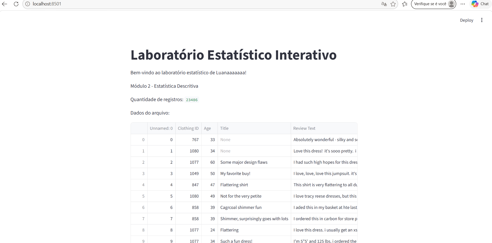
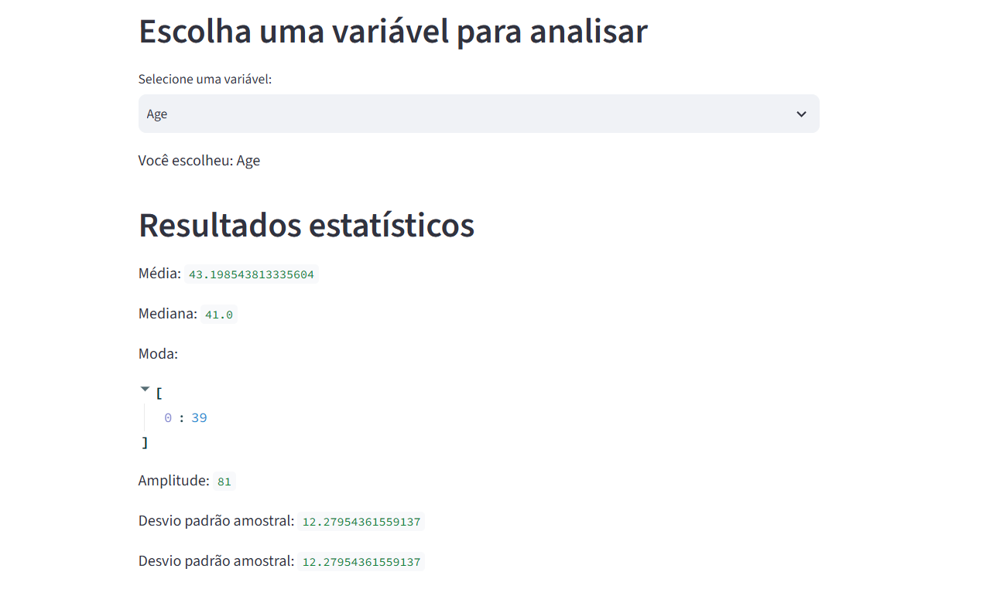
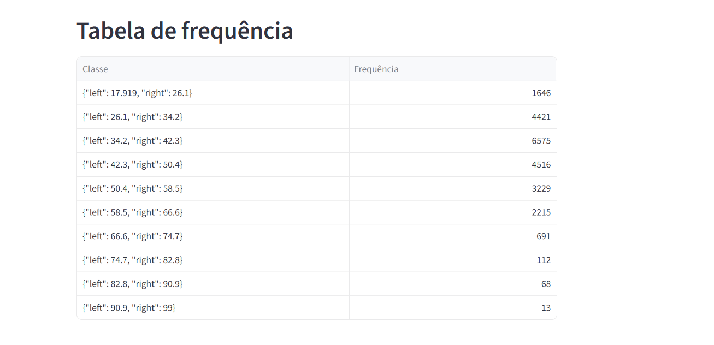
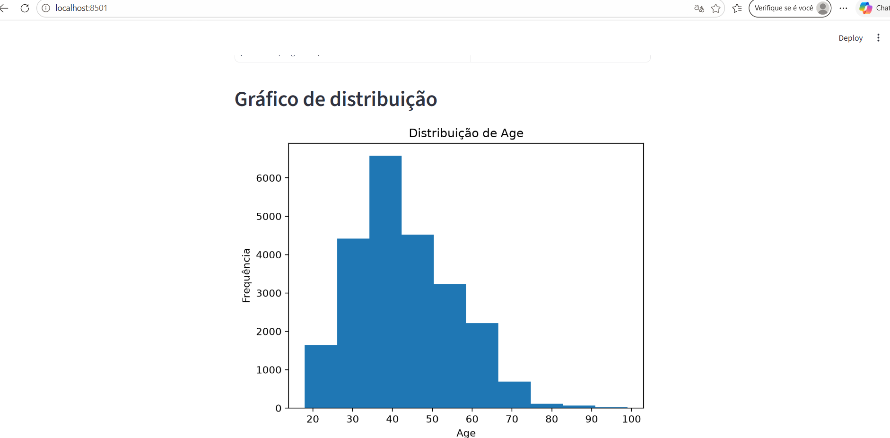
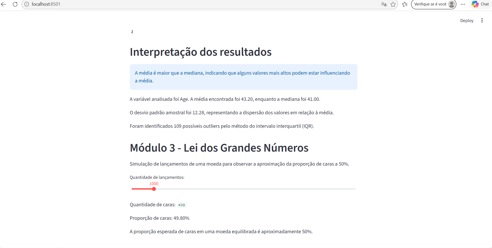
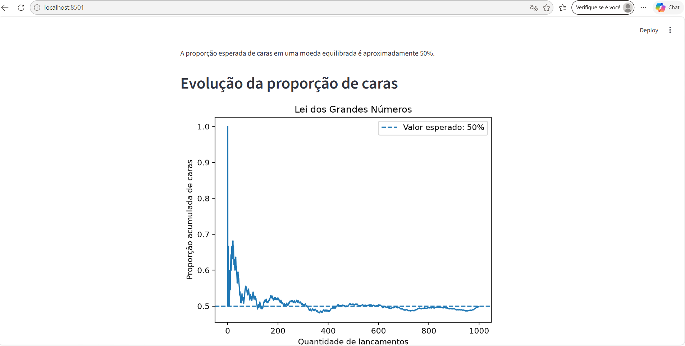
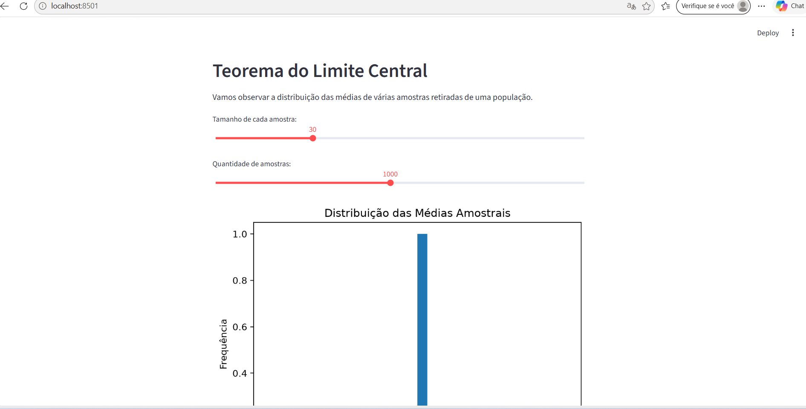
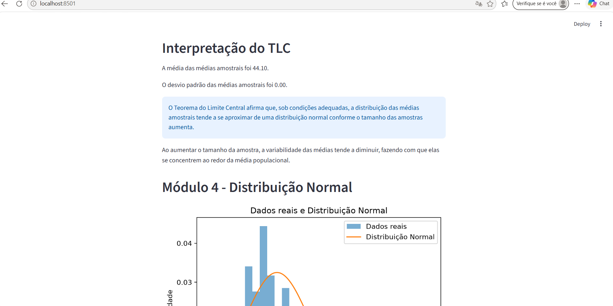
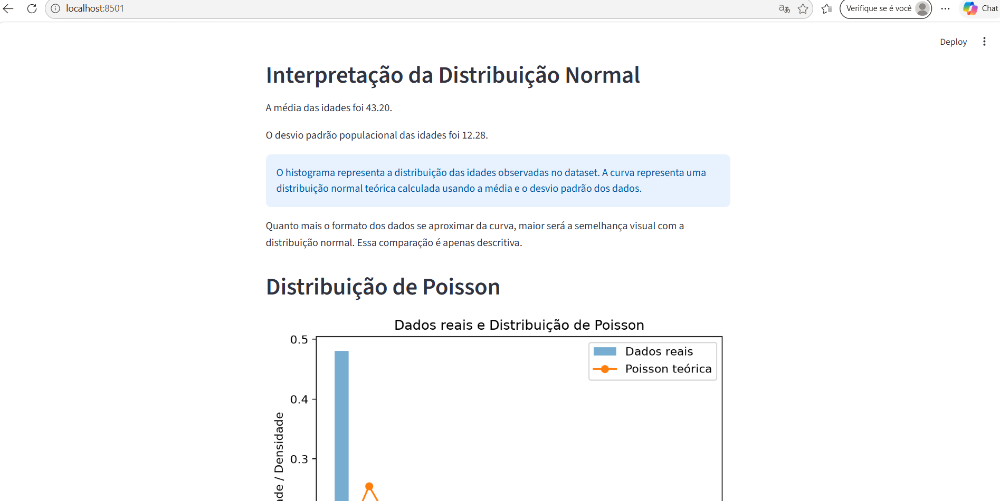
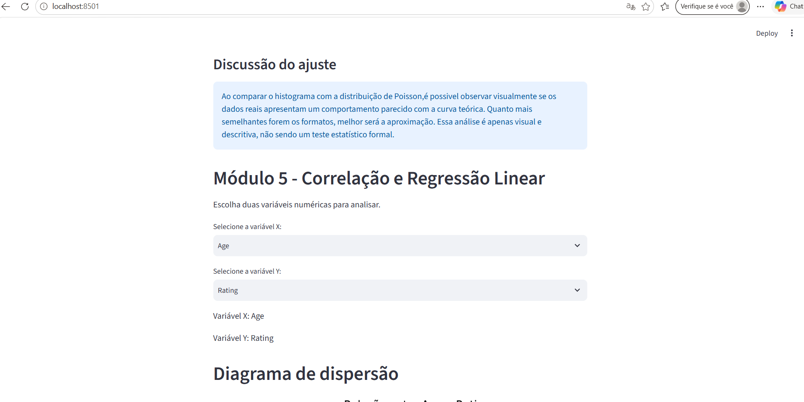
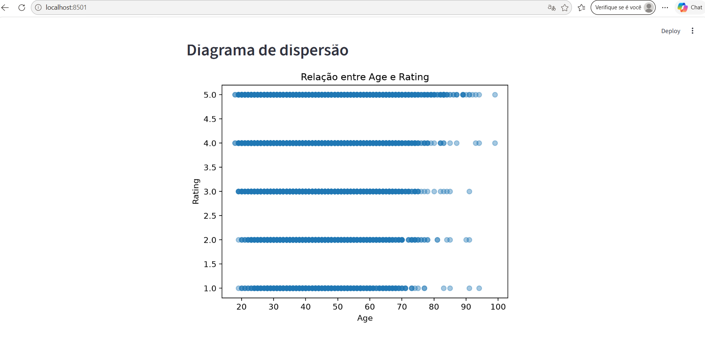
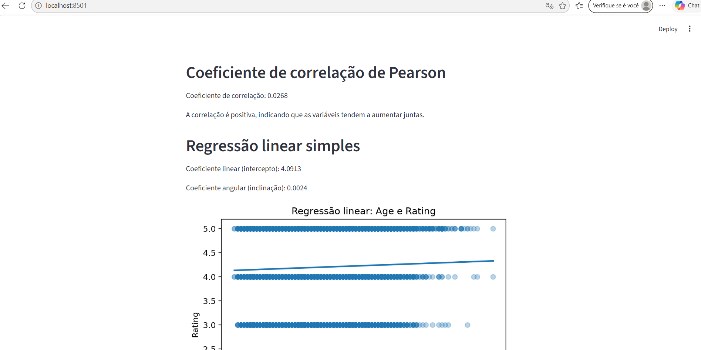
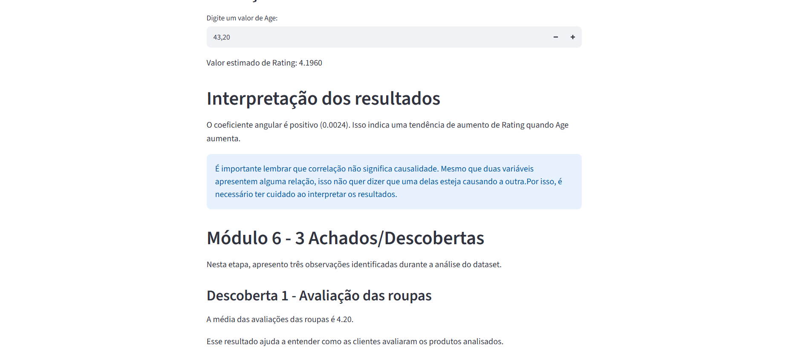


## 6. Três descobertas estatísticas

Durante a análise do dataset, foram identificadas três descobertas relacionadas às avaliações, à idade das clientes e à recomendação dos produtos.

### 6.1 Descoberta 1 - Avaliação das roupas

A média das avaliações dos produtos foi de 4.20.

Esse resultado ajuda a entender como as clientes avaliaram os produtos analisados.

### 6.2 Descoberta 2 - Idade das clientes

A idade média das clientes foi de  43.20 anos.

Essa informação ajuda a conhecer o perfil das participantes da pesquisa e permite compreender melhor a faixa etária presente nos dados.

### 6.3 Descoberta 3 - Recomendação dos produtos

Aproximadamente 82.24% dos registros indicam recomendação do produto.

Esse percentual mostra a proporção de registros em que o produto foi recomendado, ou seja, mostra a proporção de clientes que recomendaram os produtos e ajuda a compreender o comportamento de recomendação presente no dataset.

### 6.4 Considerações sobre as descobertas

As descobertas foram obtidas por meio dos cálculos estatísticos realizados na aplicação.

Os resultados são descritivos e representam apenas os registros presentes no dataset analisado. Portanto, não devem ser considerados como uma representação de todas as clientes ou de todos os produtos vendidos pela internet.

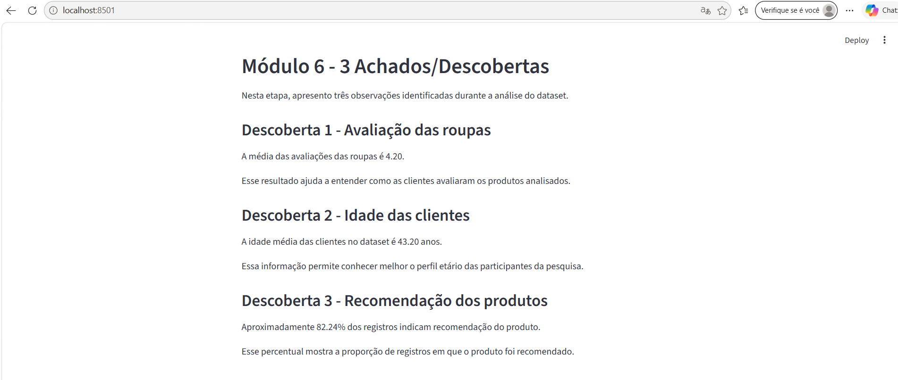

## 7. Conclusão

O desenvolvimento do Laboratório Estatístico Interativo permitiu entender, conhecer e aplicar Matemática e Estatística para Computação utilizando um dataset real.

Durante a sistematização, foram desenvolvidas funções estatísticas próprias em Python e realizados testes de validação utilizando o NumPy.

Também foi criada uma aplicação interativa com Streamlit, permitindo visualizar cálculos, tabelas, gráficos, simulações e análises estatísticas através do navegador.

Os módulos desenvolvidos ajudaram a compreender melhor conceitos como estatística descritiva, probabilidade, correlação e regressão linear.

A realização da atividade foi importante para praticar a programação em Python e entender como os conceitos estatísticos podem ser utilizados na análise de dados reais.

Como melhoria posterior, a aplicação poderia receber novas análises, mais gráficos e outras formas de explorar os dados reais que existem. 
